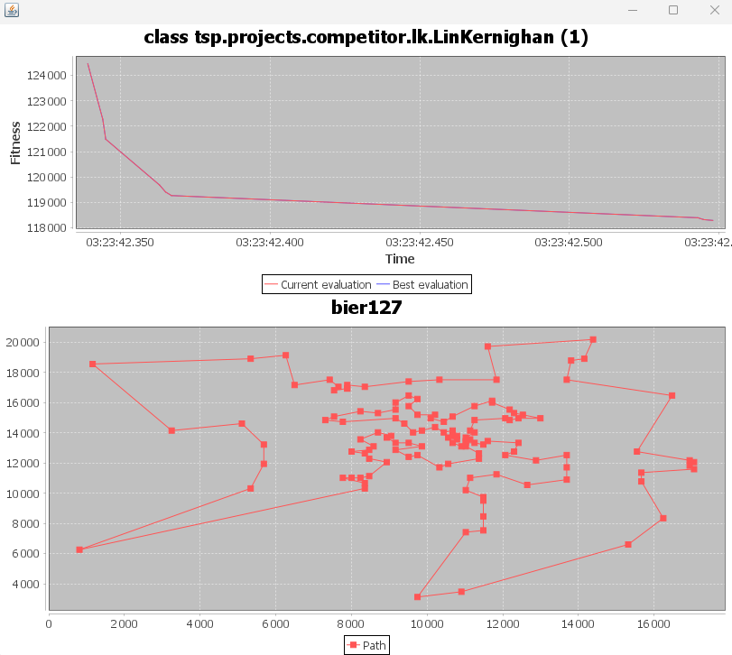

# TSP Metaheuristics

Five metaheuristics for the Travelling Salesman Problem in Java, measured against
each other on the same three instances under the same time budget.

Headline result: Lin-Kernighan with an iterated local search gets within **0.01%**
of the optimum on the 127-city instance and **0.91%** on the 666-city one. On
the 8192-city instance every method here stalls well above the optimum, and the
reason is a property of that instance rather than a shortcoming of any one
algorithm — see [Why `pr8192` is hard](#why-pr8192-is-hard).

---

## The problem

Given a set of cities and their coordinates, find the shortest closed tour that
visits every city exactly once and returns to the start.

Formally: given `n` cities and a distance `d(i, j)` between each pair, find the
permutation `π` of the cities minimising

```
length(π) = d(π(n-1), π(0)) + Σ d(π(i), π(i+1))   for i = 0 … n-2
```

Distances here are plain Euclidean, computed in double precision with no rounding:

```
d(i, j) = sqrt((xi - xj)² + (yi - yj)²)
```

The problem is NP-hard. The number of distinct tours is `(n-1)!/2`, which for the
smallest instance here, 127 cities, is already around 10^213 — so exhaustive search
is not an option and exact solvers only reach instances of this size through heavy
machinery (cutting planes, branch and bound). Everything in this repository is a
*heuristic*: it trades the guarantee of optimality for finding a good tour fast.

Each method gets a fixed budget of **60 seconds** per run, and stochastic methods
are averaged over several runs. No method is allowed to use an existing
metaheuristic library, multiple threads, or any input beyond the coordinates.

---

## The datasets

Three instances live in `data/`. They are small plain-text files, 75 KB in total, so
they are committed directly rather than downloaded. Each line is one city as
`x y`, whitespace separated, and the line number is the city's index.

```
9860 14152
9396 14616
11252 14848
```

| Instance | Cities | x range | y range | Character |
| --- | --- | --- | --- | --- |
| `bier127` | 127 | 812 … 17052 | 3132 … 20184 | The 127 beer gardens of Augsburg. A genuine clustered 2-D instance. |
| `gr666` | 666 | -90 … 90 | -175.12 … 178.25 | 666 cities worldwide. Coordinates look like latitude/longitude but are treated as planar. |
| `pr8192` | 8192 | 2 … 8192 | 0 … 1 | Not really 2-D at all: a degenerate "comb". See below. |

A fourth, unseen instance was used for the original grading of the project. It is
not in this repository; the project report recorded its optimum as 3076.

---

## The optima, and how we know them

Three instances, three different kinds of evidence. This matters, because a "gap to
optimum" is only meaningful if you know where the reference number came from.

| Instance | Optimum | How it is known | Confidence |
| --- | --- | --- | --- |
| `bier127` | 118282 | Published TSPLIB optimum | Certain, but for a slightly different objective — see caveat |
| `gr666` | 3062 | Concorde exact solver run on these coordinates | Reported, not re-verified here |
| `pr8192` | 16382 | Proved below from the structure of the instance | Certain, and agrees with Concorde |

### `bier127` — published value

`bier127` is a standard TSPLIB instance and its optimal tour length, 118282, is
published and long settled.

**Caveat worth knowing.** TSPLIB declares `bier127` as `EUC_2D`, which by
specification rounds each distance to the nearest integer. This code uses exact
real-valued distances. The two objective functions are therefore not identical, and
118282 is a close reference point rather than the true optimum of the problem being
solved here. Expect a gap of a few hundredths of a percent to be noise from this
mismatch rather than a real shortfall.

### `gr666` — exact solver

3062 comes from running [Concorde](https://www.math.uwaterloo.ca/tsp/concorde.html),
the standard exact TSP solver, on these exact coordinates. Concorde proves
optimality rather than guessing it, using branch-and-cut over the linear programming
relaxation.

This value is inherited from the original project report and has **not** been
independently re-verified in this repository, so treat it as a strong reference
rather than a certainty.

### `pr8192` — proved from the structure

This one does not need a solver at all. Inspecting the file shows `pr8192` is a
**comb**:

- there are exactly **4096 distinct x values**: 2, 4, 6, … 8192, evenly spaced by 2;
- **y only ever takes the values 0 or 1**;
- every x value carries **exactly two cities**, one at y=0 and one at y=1.

So it is 4096 vertical pairs strung along a line. That structure pins the optimum
exactly:

**Lower bound.** Take any closed tour.

1. It must reach the leftmost city (x=2) and the rightmost (x=8192) and come back to
   where it started. Projected onto the x axis, the tour is a closed walk covering
   an interval of width 8190, so the sum of the absolute horizontal displacements of
   its edges is at least `2 × 8190 = 16380`.
2. It must visit cities at y=0 and cities at y=1, so it changes row at least twice.
   Each change of row contributes at least 1 of vertical displacement, giving at
   least `2 × 1 = 2`.
3. Each edge's length is at least its horizontal displacement, and at least its
   vertical one. Summing the two disjoint contributions gives a total length of at
   least **16382**.

**Attainment.** This tour achieves it: sweep right along the whole y=0 row (8190),
step up (1), sweep left along the whole y=1 row (8190), step back down (1).

```
y=1   ←←←←←←←←←←←←←←←←←←←←←←←←←←←←←←←←←←←←←←←←←←←←←←←  8190
      ↓                                             ↑     1 + 1
y=0   →→→→→→→→→→→→→→→→→→→→→→→→→→→→→→→→→→→→→→→→→→→→→→→  8190
      x=2                                      x=8192
```

Total: `8190 + 1 + 8190 + 1 = 16382`. The bound is met, so **16382 is optimal**.
It also matches the Concorde value in the original report, which is a reassuring
independent check.

### Why `pr8192` is hard

The same structure that makes the optimum easy to prove makes it very hard for a
heuristic to find.

The shortest edges in the instance are the 4096 **vertical** edges, of length 1.
Every other edge is at least 2. So any heuristic that prefers short edges — nearest
neighbour, greedy edge, GRASP, and any local search driven by positive gain — takes
them. And taking *all* of them is exactly what guarantees a bad tour:

> If a tour uses all 4096 vertical edges, every city already has one vertical
> neighbour, so the tour is 4096 vertical "dominoes" joined into a cycle by 4096
> connecting edges. Those connections must themselves cover the x range twice, so
> they cost at least 16380. Total: `4096 + 16380 = 20476`.

The optimal tour, by contrast, uses only **two** vertical edges.

20476 is precisely what nearest neighbour returns on this instance. It is also a
very strong local optimum: the resulting zigzag cannot be improved by any single
2-opt or short Or-opt move, because each such move trades two cheap edges for two
more expensive diagonal ones. Escaping means abandoning thousands of length-1 edges
in a coordinated way, which is not something gain-driven local search discovers
incrementally.

This is why Lin-Kernighan here grinds 20476 down to about 18200 and then crawls.
Closing the remaining gap would need either a richer move set than the one
implemented here, or an instance-aware sweep. The second was deliberately rejected:
the goal was one general method that works on all three instances, not a special
case per instance.

---

## The methods

All five are general-purpose: none of them inspects the instance to decide what to
do.

### Greedy (nearest neighbour)

Start at a random city, repeatedly walk to the closest unvisited one, restart from a
new random city, keep the shortest tour. The baseline — any method that cannot beat
it is not earning its complexity.

### GRASP + convex hull

The same construction, except the next city is drawn uniformly from a *restricted
candidate list*: the candidates whose distance is within `alpha` of the spread
between the closest and the furthest. With `alpha = 0` this is nearest neighbour;
larger values trade tour quality for diversity across restarts.

Seeded with the convex hull, on the reasoning that cities on the hull appear in the
same relative order in any optimal Euclidean tour, so fixing them first ought to
cost nothing and give the randomised completion a sensible skeleton.

**It does not work.** This is the worst method in the results below, on all three
instances. Walking the entire hull before touching the interior leaves the
interior to be served by a greedy chain that has to criss-cross the whole
figure. The hull is kept here because the comparison is informative, not because
it is a good idea as implemented.

### Genetic (PMX + inversion)

A generational genetic algorithm over permutations. Each generation keeps an elite
fraction untouched and fills the rest with PMX crossover offspring of
tournament-selected parents, mutating each child with some probability.

Mutation is **inversion** — reversing a random stretch — because for a symmetric TSP
that *is* a 2-opt move: it changes two edges, where swapping two cities changes
four.

### Fourmilion (PMX + ant colony mutation)

The method originally submitted for the project. Same genetic skeleton, but the
mutation operator rebuilds a random stretch of the tour using an **Ant Colony
Optimisation** rule, choosing each next city with probability weighted by both the
inverse distance and the accumulated pheromone. The intent is a mutation that
produces a plausible sub-tour rather than a random shuffle. Its population is built
by GRASP, with one convex-hull-seeded individual.

### Lin-Kernighan + ILS

The strongest method here, and the only one that gets close to the optimum on any
instance.

Lin-Kernighan improves a tour by **chains** of edge exchanges. A chain anchored at a
city `t1` repeats:

1. break the edge `(t1, t2)`, where `t2` is the successor of `t1`;
2. pick a candidate `t3` near `t2`. The quantity `d(t1,t2) - d(t2,t3)` is the
   *partial gain*, and requiring it to stay positive is what keeps the search
   directed and finite;
3. let `t4` be the predecessor of `t3`. Breaking `(t4, t3)` and reconnecting yields a
   single valid tour containing `(t2, t3)` and `(t1, t4)` — and that reconnection is
   exactly one segment reversal;
4. the new closing edge is `(t1, t4)`, and since `t4` is now the successor of `t1`,
   the next round breaks it and the chain continues by itself.

The key point is that a chain may pass through tours that are **worse** than the one
it started from, as long as the partial gain stays positive. The cumulative real
gain is recorded at every depth and the chain is rewound to whichever depth was
best. So a step never lengthens the tour, yet it reaches improvements no monotone
descent would find. Plain 2-opt is this chain truncated at depth one.

**Or-opt** moves complement it, relocating a run of one to three cities elsewhere in
either orientation — 3-opt moves that chains of reversals do not reach cheaply.

On top sits an **iterated local search**: perturb the best tour with a double bridge
(cut into four blocks, reassemble as A C B D), re-optimise, keep the result if it is
shorter. The double bridge is the standard kick because no single 2-opt or Or-opt
move undoes it, so the perturbation survives the next descent.

Three implementation details do most of the work for performance:

- **candidate lists** — only the 8 nearest cities are considered, since an improving
  move nearly always introduces a short edge, so scanning all `n` buys almost
  nothing for `n` times the cost;
- **don't-look bits** — a city is re-examined only when one of its incident edges
  actually changed, which keeps the work queue tiny after the first pass;
- **bounded kicks** — the double bridge displaces at most 50 positions. With cut
  points drawn uniformly, a kick on a large tour splices together distant parts of
  it; repairing the three long edges that creates wakes much of the tour and usually
  just undoes the kick. Bounding the blocks raised the iteration count on the
  8192-city instance roughly sevenfold.

The move set is 2-opt (depth one of the chain), the deeper sequential exchanges the
chain builds on top of it, and Or-opt. Richer basic moves exist and are not
implemented here.

---

## Results

Protocol: **60 seconds per run, 3 runs per method**, fixed seeds, single thread, JDK 21. Every tour produced was verified to be a valid permutation of the cities.

The headline figures are the **best of the 3 runs**, and the gap is measured from that best tour. The spread across runs is in the table underneath, since a method that is good only occasionally is worth telling apart from one that is good every time.

| Method | `bier127`<br>optimum 118 282 | `gr666`<br>optimum 3 062 | `pr8192`<br>optimum 16 382 |
| --- | --- | --- | --- |
| **Greedy (nearest neighbour)** | 130 711 &nbsp; **+10.51%** | 3 835 &nbsp; **+25.25%** | 20 476 &nbsp; **+24.99%** |
| **GRASP + convex hull** | 158 295 &nbsp; **+33.83%** | 4 370 &nbsp; **+42.71%** | 36 851 &nbsp; **+124.95%** |
| **Genetic (PMX + inversion)** | 122 985 &nbsp; **+3.98%** | 3 332 &nbsp; **+8.80%** | 20 375 &nbsp; **+24.37%** |
| **Fourmilion (PMX + ACO mutation)** | 127 034 &nbsp; **+7.40%** | 3 551 &nbsp; **+15.96%** | 20 475 &nbsp; **+24.98%** |
| **Lin-Kernighan + ILS** | 118 294 &nbsp; **+0.01%** | 3 090 &nbsp; **+0.91%** | 18 225 &nbsp; **+11.25%** |

<details>
<summary>Spread across the three runs</summary>

| Method | Instance | Best | Mean | Worst | Gap (best) | Gap (mean) |
| --- | --- | --- | --- | --- | --- | --- |
| Greedy (nearest neighbour) | `bier127` | 130 711 | 130 711 | 130 711 | +10.51% | +10.51% |
| Greedy (nearest neighbour) | `gr666` | 3 835 | 3 835 | 3 835 | +25.25% | +25.25% |
| Greedy (nearest neighbour) | `pr8192` | 20 476 | 20 476 | 20 476 | +24.99% | +24.99% |
| GRASP + convex hull | `bier127` | 158 295 | 158 295 | 158 295 | +33.83% | +33.83% |
| GRASP + convex hull | `gr666` | 4 370 | 4 370 | 4 371 | +42.71% | +42.72% |
| GRASP + convex hull | `pr8192` | 36 851 | 36 851 | 36 851 | +124.95% | +124.95% |
| Genetic (PMX + inversion) | `bier127` | 122 985 | 123 351 | 123 692 | +3.98% | +4.29% |
| Genetic (PMX + inversion) | `gr666` | 3 332 | 3 351 | 3 362 | +8.80% | +9.44% |
| Genetic (PMX + inversion) | `pr8192` | 20 375 | 20 375 | 20 376 | +24.37% | +24.38% |
| Fourmilion (PMX + ACO mutation) | `bier127` | 127 034 | 127 833 | 128 481 | +7.40% | +8.07% |
| Fourmilion (PMX + ACO mutation) | `gr666` | 3 551 | 3 588 | 3 628 | +15.96% | +17.16% |
| Fourmilion (PMX + ACO mutation) | `pr8192` | 20 475 | 20 475 | 20 476 | +24.98% | +24.99% |
| Lin-Kernighan + ILS | `bier127` | 118 294 | 118 294 | 118 294 | +0.01% | +0.01% |
| Lin-Kernighan + ILS | `gr666` | 3 090 | 3 095 | 3 104 | +0.91% | +1.08% |
| Lin-Kernighan + ILS | `pr8192` | 18 225 | 18 457 | 18 714 | +11.25% | +12.66% |

</details>
### What the table says

- **Lin-Kernighan wins on every instance**, and the ranking is identical on all
  three: Lin-Kernighan, then Genetic, then Fourmilion, then Greedy, then GRASP.
  That consistency is the real result. The goal was one general method that holds
  up across instances, not a different winner per instance.
- **On `bier127` it is essentially optimal.** 118 294 against a reference of
  118 282 is 0.01%, and all three runs returned the identical tour. Since the
  reference is defined over integer-rounded distances while this code uses exact
  ones, that remaining hundredth of a percent is within the noise of the mismatch
  rather than a real shortfall.
- **Greedy lands on exactly 20 476 on `pr8192`** — not approximately, exactly the
  value the trap argument above predicts. That is the analysis confirming itself.
- **The convex hull seed is counterproductive on all three instances.** GRASP with
  the hull is the worst method in the table everywhere, and more than twice the
  optimum on `pr8192`. The reasoning behind the hull is sound: its cities really do
  keep their relative order in an optimal tour. But completing it by walking the
  *entire* hull first and only then filling in the interior forces the interior
  path to criss-cross the figure. The idea needs a cheapest-insertion heuristic,
  not an append.
- **The ant colony mutation does not pay for itself.** Genetic, with nothing more
  than inversion mutation, beats Fourmilion on all three instances. One caveat
  worth stating plainly: the two configurations differ in population size, elite
  share, mutation rate *and* seeding, not only in the mutation operator, so this is
  not a clean ablation. Given the previous point, the GRASP-and-hull seeding is a
  plausible culprit.
- **Only Lin-Kernighan makes real progress on `pr8192`**, from 20 476 down to
  18 225. Every other method is pinned within a fraction of a percent of the greedy
  trap value, which is what the structure of that instance predicts.
- **Lin-Kernighan is also the most stable.** Its spread across runs is the
  narrowest of the five on the two well-behaved instances, and zero on `bier127`.

### Seeing it run



Lin-Kernighan on `bier127` under the competition harness. The top panel is tour
length over time, the bottom one the tour itself, both redrawn live as the search
runs.

Three things are worth reading off it.

The time axis spans about **170 milliseconds**. The whole descent, from a starting
tour near 124 500 down to 118 300, is over in under a fifth of a second; the
remaining 59.8 seconds of the budget buy nothing on an instance this small. The time
limit is not what constrains the result here — the move set is.

The two series coincide because the adapter only submits a tour when it improves on
the previous best, so "current" and "best" are the same points. A method like
Greedy, which rebuilds a complete tour on every iteration and submits each one,
produces a far more agitated curve.

The long edges in the bottom panel are not a defect. `bier127` is the 127 beer
gardens of Augsburg and several of them are genuinely isolated, so reaching them
costs what it costs. This tour is 0.01% above the published optimum: that is what
near-optimal looks like on this instance.

---

## Repository layout

```
.
├── data/                              the three instances
├── requirements.txt                   dependencies and how to fetch them
└── src/tsp/
    ├── bench/Benchmark.java           headless seeded runner; produces the table above
    ├── evaluation/                    instance loading, tour validation, scoring
    ├── output/                        console and log file writers
    ├── run/                           competition harness with live JFreeChart plots
    └── projects/
        ├── demo/                      random search, random walk, hill climbing
        └── competitor/
            ├── common/                shared algorithms and operators
            ├── greedy/                nearest neighbour, restarted
            ├── grasp/                 randomised greedy with convex hull seed
            ├── genetic/               GA, PMX, inversion
            ├── fourmilion/            GA with ant colony mutation
            └── lk/                    Lin-Kernighan + ILS
```

`competitor/common/` holds everything reusable — `TspInstance` (coordinates,
distances, candidate lists), the constructions, the convex hull, the crossover,
mutation and selection operators, the configurable `GeneticAlgorithm`, and
`LinKernighanSearch`. Methods are written against a small `Solver` interface rather
than against the framework, which is what lets the same code run under both the
competition harness and the headless benchmark instead of existing twice.

---

## Building and running

Requires a JDK 17 or later; built and measured with JDK 21.

### Benchmark — no dependencies

```bash
javac -encoding UTF-8 -d build $(find src -name '*.java' -not -path '*/run/*')

# [secondsPerRun] [runsPerMethod], defaults to 60 10
java -Xmx3g -cp build tsp.bench.Benchmark 60 3
```

Run it from the repository root, since instances are loaded from `./data`. Every run
is seeded from its run index, so the table reproduces exactly.

### Competition harness — needs the jars

Discovers every method by reflection, runs them all against every instance, and
plots progress live. Fetch the jars into `lib/` first; see `requirements.txt`.

```bash
javac -encoding UTF-8 -d build -cp "lib/*" $(find src -name '*.java')
java -cp "build;lib/*" tsp.run.Main       # Linux and macOS: build:lib/*
```

The constants at the top of `Main.java` control the number of runs, the seconds per
run, and whether charts and console output are shown.

---

## Limitations

- `pr8192` stays about 11% above optimal. This is a basin that gain-driven local
  search does not escape; closing it properly needs a richer move set rather than
  tuning what is here.
- The convex hull seed *hurts* on all three instances, not just the large one,
  giving a worse starting tour than plain nearest neighbour everywhere. It is
  kept for comparison rather than because it helps.
- `gr666`'s reference optimum is a reported Concorde value, not one verified here.
- `bier127`'s reference optimum is defined over integer-rounded distances while this
  code uses exact Euclidean ones, so the two objectives differ slightly.
- Results are averaged over 3 runs rather than 10, to keep a full sweep of all five
  methods under an hour.
- The genetic methods hold a full population of tours, so they want `-Xmx3g` on the
  8192-city instance.
